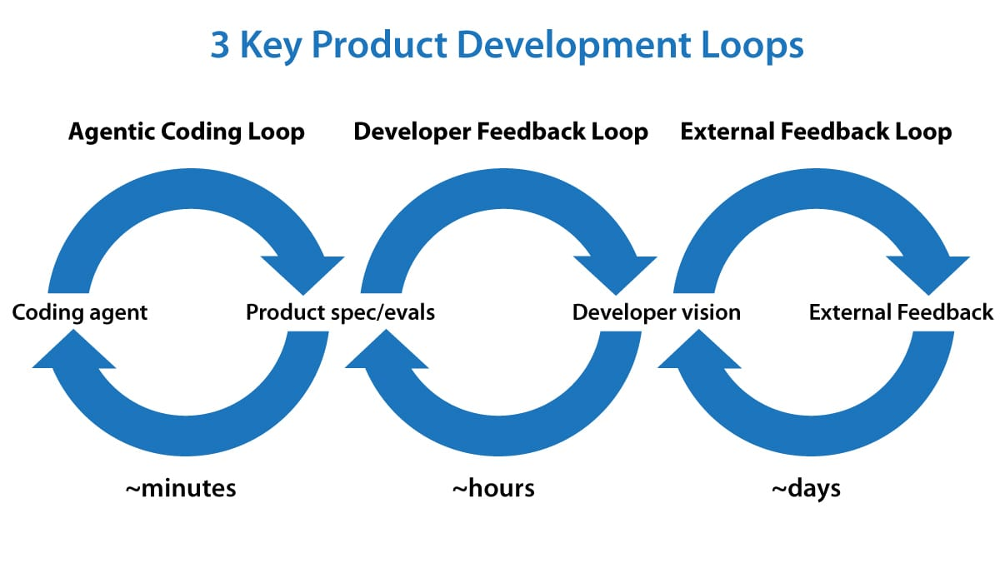

# Three Key Loops for Building Great Software

> **Source**: [charonhub.deeplearning.ai/three-key-loops-for-building-great-software/](https://charonhub.deeplearning.ai/three-key-loops-for-building-great-software/)
> **Author**: Andrew Ng
> **Published**: 2026-06-26 (The Batch, Issue 359)
> **Category**: Letters from Andrew Ng
> **Downloaded**: 2026-07-15

> **Subtitle**: AI-assisted agentic coding reinforces iterative software development. These three loops can guide development and help you decide what to build.

---

---

Dear friends,

"Loop engineering" is a hot buzzphrase after mentions of it by Boris Cherny (Claude Code's creator) and Peter Steinberger (OpenClaw's creator) went viral on social media. Loops are now a key part of how we get AI agents to iterate at length to build software. In this letter, I'd like to share my **3 key loops**, shown in the image above, for building 0-to-1 products. These loops guide not just how I build software, but also how I decide what software to build.

## 1. Agentic coding loop (minutes)

Given a product specification and optionally a set of evals (that is, a dataset against which to measure performance), we can have an AI agent write code, test its work, and keep iterating until the code is bug-free and meets its specification. This idea of closing the loop took off around the end of last year, and it has been a game changer in enabling coding agents to work longer productively without human intervention.

For example, over the weekend, I was building an app for my daughter to practice typing, and my coding agent could easily work for around an hour, using a web browser to check what it had built multiple times before getting back to me, without needing my intervention.

The engineering loop executes quickly. Every few minutes, the coding agent might build and test a new version of the software. I hear frequently from developers who are finding new ways to engineer more effective engineering loops. This is an active area of invention!

## 2. Developer feedback loop (tens of minutes to hours)

In this loop, a developer examines the current product and steers the coding agent to improve it. Last year, a lot of developers (including me) were acting as the QA (quality assurance) function for our coding agents, manually finding bugs and then asking the agent to fix them. But with coding agents much more able to test their own code, the amount of time we need to spend on this function has decreased significantly. This allows us to make higher-level product decisions, such as what key features to offer, where the UI needs improvement, and so on.

The developer-feedback loop operates over time intervals between tens of minutes and hours — that's how frequently a developer might review a product and give feedback. In the case of the typing app, I changed my mind a few times about the visual design, what cat costumes she can unlock as she learns (she loves cats), and the user flow for a grown-up to log in and steer the child's learning experience.

When a developer has a clear vision for what to build, it is still a lot of work to translate that vision into a specification for a coding agent to implement. Further, after the developer has seen an implementation, they might update (or perhaps clarify) the spec to steer it toward what they want. If you find that the system repeatedly runs into certain problems, building a set of evals for the agent becomes useful.

AI-native teams are increasingly using AI to help shape product direction — for example, automating the gathering and analysis of usage data, summarizing written and verbal customer feedback, or carrying out competitive analysis. However, for pretty much all the products I'm involved in, I see humans as having a significant **context advantage** over current AI systems — we know a lot more than the AI system about the users and the context the product has to operate in — and thus humans play a critical role. Many people describe this human contribution as "taste," but I prefer to think of it as humans having a context advantage, since that gives us a clearer path to helping AI systems get better. This also speaks to why this step can't be automated: So long as the human knows something the AI does not, human-in-the-loop is needed to inject that knowledge into the system.

## 3. External feedback loop (days to weeks)

This includes a wide range of tactics — like asking a few friends for feedback, launching to alpha testers, or putting the code into production with A/B testing. These tactics are usually slow, rarely taking less than hours and sometimes taking days or even weeks. This data informs the developer vision, which in turn continues to drive the detailed product spec, which in turn drives the coding agent.

With coding agents speeding up software development, more engineers are starting to play a partial product management role. For many engineers who are growing into this role, the hardest part is shaping the product vision and striking a balance between **building** (bridging the gap between vision and spec) and **getting user feedback** to evolve the vision. It is important to do both!

I will write more about how to do this in future letters, but for now, I find it encouraging that engineers are playing an expanded role (just as product managers and designers now do more engineering).

Keep building!

Andrew

---

## Saved assets

| File | Description |
|------|-------------|
| `andrew-ng-three-key-loops.md` | This file — full article text |
| `images/01-three-key-loops.jpg` | "3 Key Product Development Loops" diagram (1200×676) — alt: Agentic Coding Loop (minutes), Developer Feedback Loop (hours), External Feedback Loop (days) |

## Companion article (same author, related)

- **"Make All Your Tokens (and Your Brainwork) Count: Agentic loop coding works until it fulfills a goal"** — Andrew Ng 的另一篇相关 letter（链接：https://charonhub.deeplearning.ai/make-all-your-tokens-and-your-brainwork-count/）— 如需也保存告诉我。

## Key takeaway

The three loops differ on **timescale** and **who acts**:

| Loop | Timescale | Who acts | Purpose |
|------|-----------|----------|---------|
| Agentic coding loop | minutes | AI | Write → test → iterate until spec met |
| Developer feedback loop | tens of minutes to hours | Human developer | Steer agent with vision + spec |
| External feedback loop | days to weeks | Real users | Inform vision → spec → agent |

Critical insight: **humans still win on context advantage** — we know the users and the deployment context in ways current AI doesn't, so the developer-feedback loop can't be fully automated.

## Notes (download 2026-07-15)

- Source host: `charonhub.deeplearning.ai` (The Batch on Ghost CMS) — this is deeplearning.ai's own content hub, not a third-party mirror.
- Andrew Ng 在文中提到 **Peter Steinberger** 是 OpenClaw 的 creator — 跟我们 MEMORY.md 里之前写的 "Peter Steve" 对不上，**Peter 全名是 Peter Steinberger**（不是 Steve）。MEMORY.md 那边需要更正。
